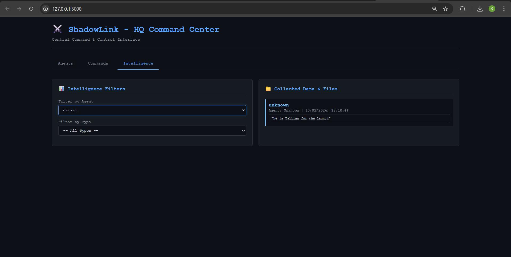
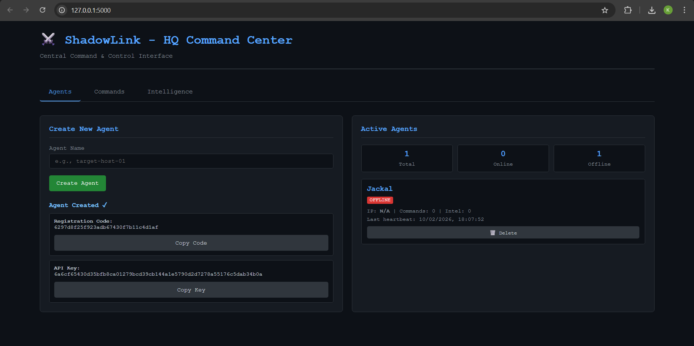
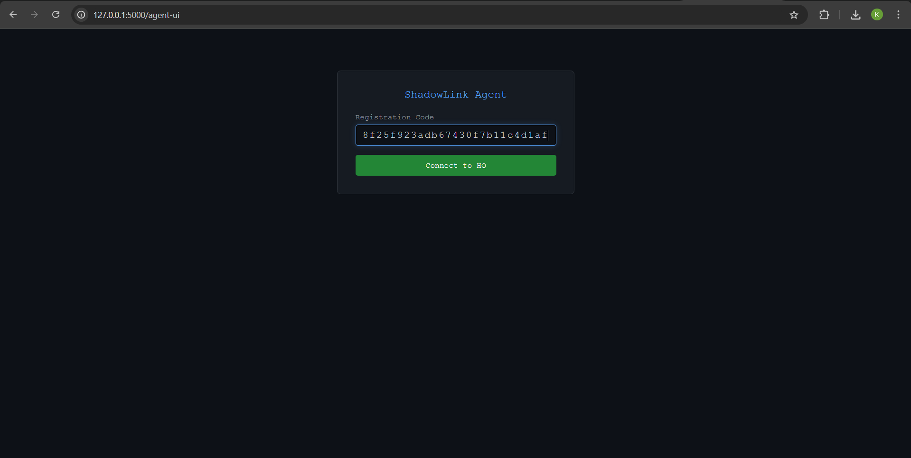
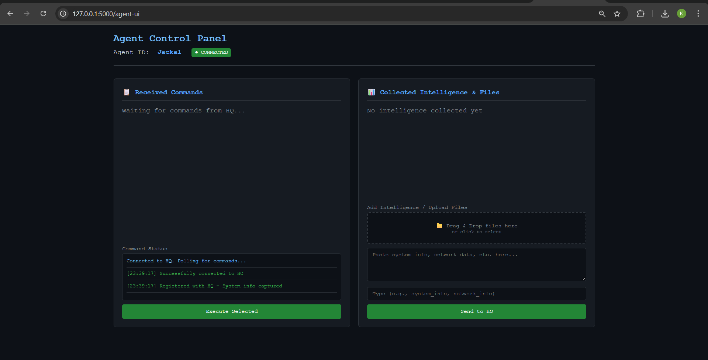
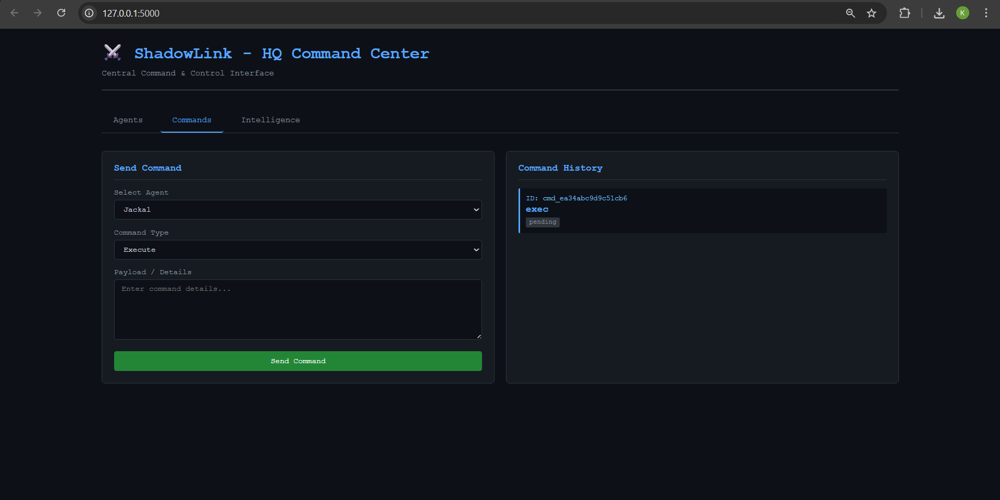
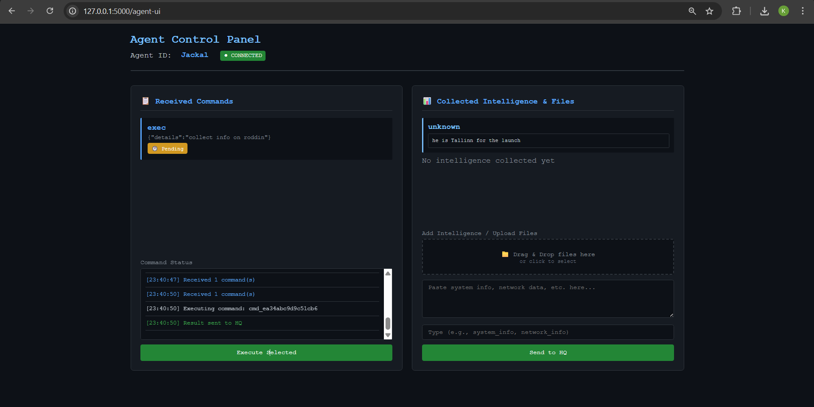
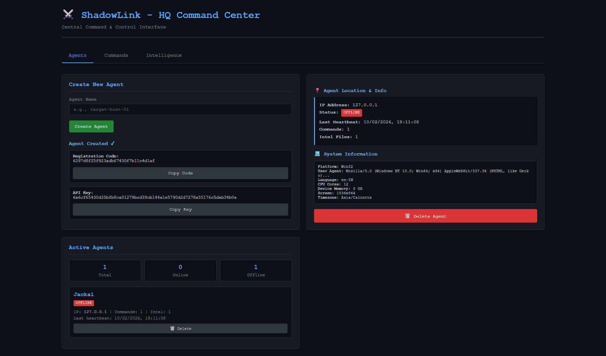

🕶️ ShadowLink — HQ Command Center

Distributed Command & Control Simulation for Backend Architecture Learning

 

A Fictional, Educational Command & Control System designed to demonstrate advanced backend logic, networking concepts, and distributed system architectures.

View Demo • Documentation • Ethical Use

⚠️ IMPORTANT DISCLAIMER

ShadowLink is a purely educational project.

It is designed to simulate the architectural patterns of a distributed system (Agent/Server communication). It does NOT contain malware, real exploits, persistence mechanisms, or unauthorized control capabilities.

Please review ETHICAL_USE.md for full legal and ethical guidelines.

🧠 Overview

ShadowLink simulates a professional "HQ" server communicating with multiple remote agents. Unlike basic CRUD apps, this project implements real-world networking patterns found in distributed systems and enterprise management software.

It was built to master:

Agent Identity & Registration: Securely onboarding remote clients.

Heartbeat Monitoring: Tracking "Liveness" across a distributed network.

Command Queues: Asynchronous task dispatching and result aggregation.

State Management: Handling connection states (Online/Offline/Busy) in real-time.

The project is intentionally designed to be:
✅ Safe and Ethical

✅ Interview-Ready Architecture

✅ Fully runnable locally

✅ Easy to demo with one command

🎬 UI Walkthrough & Screenshots

Below is a guided walkthrough of ShadowLink’s UI flow, from HQ to Agent and back.

🖥️ HQ Dashboard (Overview)

The main command center showing agents, status, and system overview.

🧑‍💻 Create & Register Agent (HQ Side)

Create a new agent and generate a secure registration code and API key.

🛰️ Agent Login / Registration

Agent uses the registration code to securely connect to HQ.

📊 Agent Dashboard (Connected)

Once connected, the agent dashboard shows connection status and polling state.

🎯 HQ Command Dashboard

HQ can dispatch commands to connected agents and track command history.

🤖 Agent Command & Intelligence Panel

Agent receives commands, executes simulated actions, and submits intelligence.

🗂️ HQ Agent Intelligence & Info

HQ reviews collected intelligence and detailed agent information.

🧩 System Architecture

ShadowLink utilizes a polling-based Client-Server architecture to simulate network communication.

graph LR
    A[Browser / HQ UI] -- REST API --> B[HQ Server (Flask)]
    B -- JSON Response --> A
    C[Agent (Client)] -- Heartbeat / Poll --> B
    B -- Command Queue --> C
    C -- Result / Intel --> B

Core Concepts Implemented

RESTful API Design: Clean endpoints for agent communication (/api/heartbeat, /api/register).

Liveness Tracking: Server-side logic to detect dead agents based on missed heartbeats.

Command Pattern: Queueing commands for agents to pick up on their next check-in.

Security Awareness: Implementation of registration codes and API keys (simulated).

📄 Detailed Design: See docs/ARCHITECTURE.md

🚀 Quick Start (One-Command Demo)

You can run the entire system (HQ Server + Agent Simulator) with a single command. This script sets up the environment, installs dependencies, and launches both services.

Prerequisites

Python 3.8+

Git

1. Clone the Repo

git clone [https://github.com/sharan089/ShadowLink.git](https://github.com/sharan089/ShadowLink.git)
cd ShadowLink

2. Run the Demo

Windows:

run_demo.bat

Linux / macOS:

python run_demo.py

3. Access the System

HQ Dashboard: http://127.0.0.1:5000

Agent Simulator: http://127.0.0.1:5000/agent-ui

🛠️ Tech Stack

Backend: Python, Flask, SQLAlchemy

Frontend: HTML5, CSS3 (Dark Mode), Vanilla JavaScript (Fetch API)

Database: SQLite (Local/Portable)

Architecture: REST, Polling-based communication

Deployment: Localhost (Demo-ready)

🔐 Security & Ethics (By Design)

To ensure this tool remains educational and safe to host on GitHub, ShadowLink intentionally excludes:

❌ Real command execution (All commands are simulated/echoed)
❌ Persistence mechanisms (Registry keys, startup folders)
❌ Encryption / Obfuscation
❌ Privilege escalation or Evasion techniques

This ensures the project is safe to share, safe to demo, and legal to own.

👤 Author

Sarvesh Shivasharan Built for learning backend systems, networking concepts, and distributed architectures.

MIT License © 2026 Sarvesh Shivasharan

